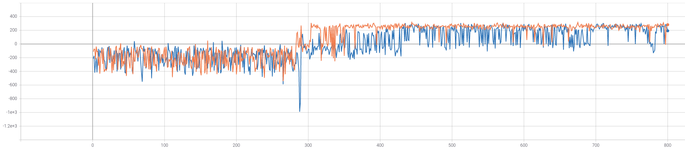
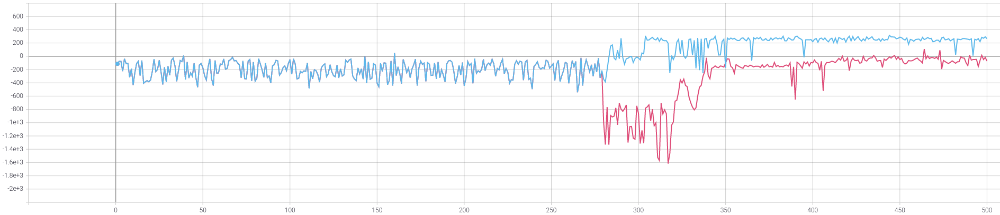
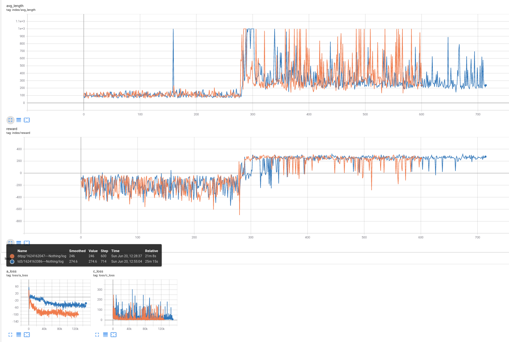
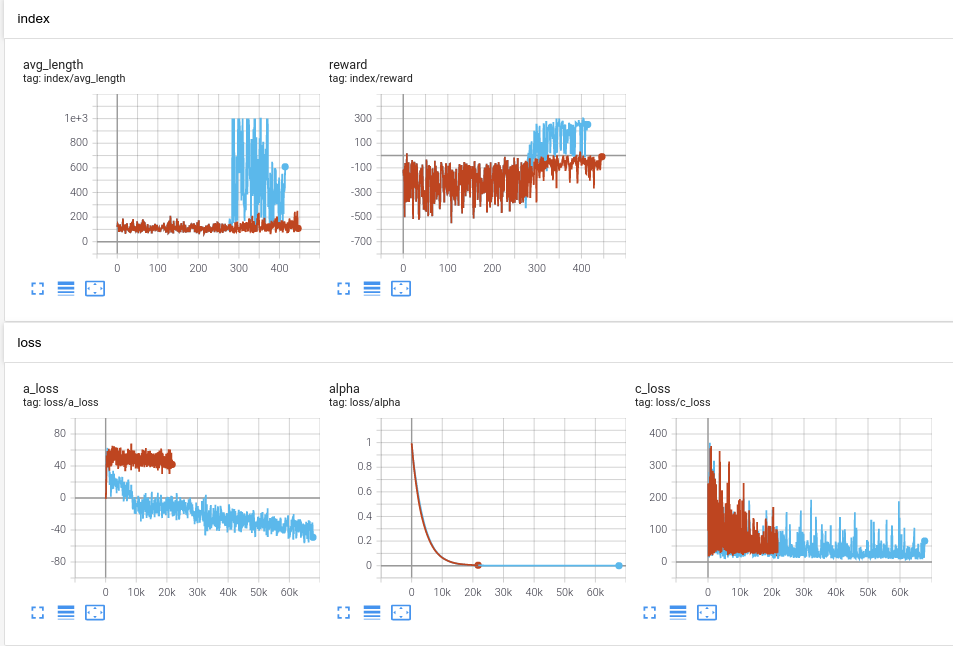
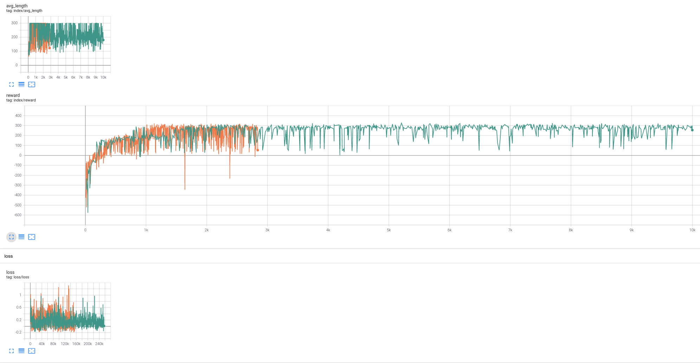

# LunarLanderContinuous-v2, TD3

- 令人震惊的发现... 激活函数为relu，seed为1998，橙色曲线（网络宽度为256），蓝色曲线（网络宽度为64）：
<p align="center"><br></p>

---

- 网络宽度为256，seed为1998，蓝色曲线（激活函数为relu），红色曲线（激活函数为tanh）：
<p align="center"><br></p>

```python
class Actor(Model):
    def __init__(self, config):
        super(Actor, self).__init__(config, model_id=0)

        self.fc = nn.Sequential(
            nn.Linear(config.dim_state, 256), nn.ReLU(),
            nn.Linear(256, 256), nn.ReLU(),
            nn.Linear(256, config.dim_action), nn.Tanh(),
        )
        self.apply(init_weights)
    
    def forward(self, state):
        return self.fc(state)


class Critic(Model):
    def __init__(self, config):
        super(Critic, self).__init__(config, model_id=0)

        self.fc1 = nn.Sequential(
            nn.Linear(config.dim_state+config.dim_action, 256), nn.ReLU(),
            nn.Linear(256, 256), nn.ReLU(),
            nn.Linear(256, 1),
        )
        self.fc2 = copy.deepcopy(self.fc1)
        self.apply(init_weights)

    def forward(self, state, action):
        x = torch.cat([state, action], 1)
        return self.fc1(x), self.fc2(x)
    
    def q1(self, state, action):
        x = torch.cat([state, action], 1)
        return self.fc1(x)
```


- 网络宽度为256，seed为1998，激活函数为relu，橙色曲线（DDPG），蓝色曲线（TD3）：
<p align="center"><br></p>


---


# LunarLanderContinuous-v2, SAC

- logstd_max设置为5（练不出来）与logstd_max设置为1（能练出来）：
<p align="center"><br></p>


# LunarLanderContinuous-v2, PPO

- batch_size=32(橙色)与batch_size=(64,128,256)(记不清了，绿色)对比：


# notes

- PPO的 K_epochs 参数不能过大，否则会越练越差(K_epochs=4 与 K_epochs=40的对比)
<p align="center"><br></p>


- PPO: tricks to add

```python

import torch

if params.CLIP_GRAD_NORM != -1:
    torch.nn.utils.clip_grad_norm(net.parameters(), params.CLIP_GRAD_NORM)

params.CLIP_GRAD_NORM = -1   ????


params.VALUE_MULTIPLIER * val_loss
params.VALUE_MULTIPLIER = 0.1


def adv_normalize(adv):
    std = adv.std()
    
    assert std != 0. and not ch.isnan(std), 'Need nonzero std'
    n_advs = (adv - adv.mean())/(adv.std()+1e-8)
    return n_advs


buffer = self.T = 2048


    "ppo_lr_adam": [1.5e-4] * 40,
    "val_lr": [1e-4],


### reward scale
class RewardFilter:
    """
    "Incorrect" reward normalization [copied from OAI code]
    Incorrect in the sense that we 
    1. update return
    2. divide reward by std(return) *without* subtracting and adding back mean
    """
    def __init__(self, prev_filter, shape, gamma, clip=None):
        assert shape is not None
        self.gamma = gamma
        self.prev_filter = prev_filter
        self.rs = RunningStat(shape)
        self.ret = np.zeros(shape)
        self.clip = clip

    def __call__(self, x, **kwargs):
        x = self.prev_filter(x, **kwargs)
        self.ret = self.ret * self.gamma + x
        self.rs.push(self.ret)
        x = x / (self.rs.std + 1e-8)
        if self.clip:
            x = np.clip(x, -self.clip, self.clip)
        return x
    
    def reset(self):
        self.ret = np.zeros_like(self.ret)
        self.prev_filter.reset()

class RunningStat(object):
    '''
    Keeps track of first and second moments (mean and variance)
    of a streaming time series.
     Taken from https://github.com/joschu/modular_rl
     Math in http://www.johndcook.com/blog/standard_deviation/
    '''
    def __init__(self, shape):
        self._n = 0
        self._M = np.zeros(shape)
        self._S = np.zeros(shape)
    def push(self, x):
        x = np.asarray(x)
        assert x.shape == self._M.shape
        self._n += 1
        if self._n == 1:
            self._M[...] = x
        else:
            oldM = self._M.copy()
            self._M[...] = oldM + (x - oldM) / self._n
            self._S[...] = self._S + (x - oldM) * (x - self._M)
    @property
    def n(self):
        return self._n
    @property
    def mean(self):
        return self._M
    @property
    def var(self):
        return self._S / (self._n - 1) if self._n > 1 else np.square(self._M)
    @property
    def std(self):
        return np.sqrt(self.var)
    @property
    def shape(self):
        return self._M.shape


observation normalization 比较重要，value function normalization和Gradient clipping不是那么重要。
```
